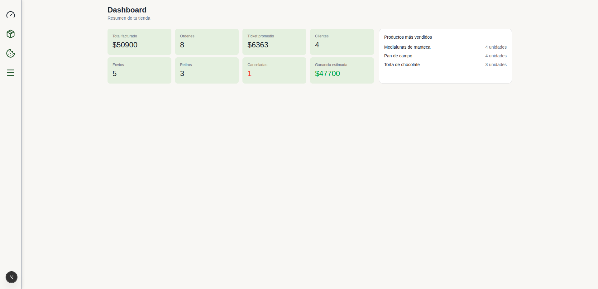
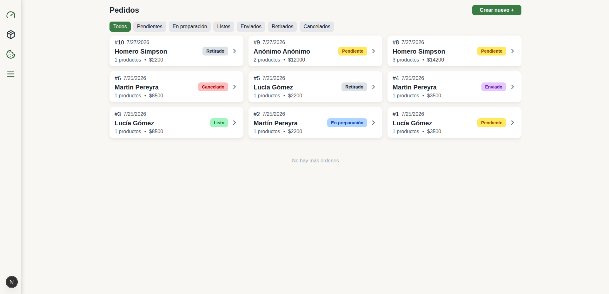
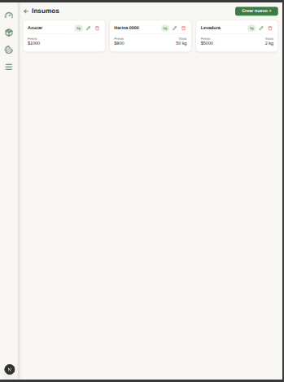
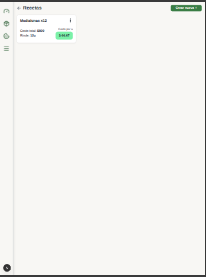
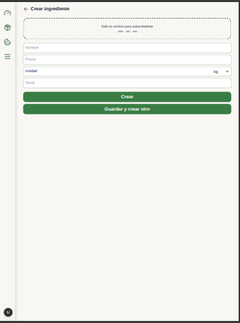
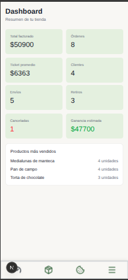
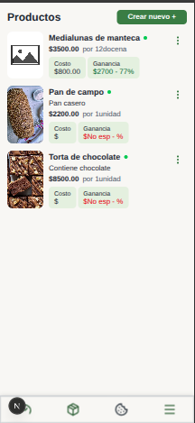
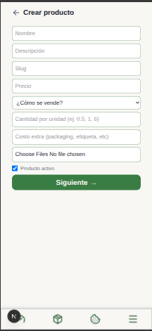

# GastroHub 🥖🌿

SaaS multi-tenant para la gestión integral de emprendimientos gastronómicos (panaderías, pastelerías, etc.). Nacido a partir de Sabores Naturales, un proyecto real para un emprendimiento de panadería, evolucionado en una plataforma que permite alojar múltiples organizaciones independientes bajo una misma aplicación, cada una con su equipo, roles y catálogo propio.

---

## 📸 Capturas

GastroHub está pensado mobile-first y probado en desktop, tablet y mobile:

### Desktop

| Dashboard | Órdenes |
|---|---|
|  |  |

### Tablet

| Dashboard | Menú | Ingredientes | Recetas | Crear ingrediente |
|---|---|---|---|---|
|  |  |  |  |  |

### Mobile

| Dashboard | Productos | Crear producto |
|---|---|---|
|  |  |  |

---

## ✨ Features

**Multi-tenancy & equipos**
- Organizaciones aisladas por `organizationId` (cada negocio ve solo sus propios datos)
- Sistema de roles por organización: **OWNER**, **ADMIN**, **STAFF**
- Gestión de miembros del equipo, independiente de los clientes de la tienda

**Panel de administración**
- CRUD de productos con imágenes, slugs y variantes de venta
- Sistema de recetas con ingredientes, rendimiento y cálculo de costo automático
- Cálculo de ganancia por producto, ya sea a partir de una receta o de un costo manual (pensado para productos de reventa que no se elaboran in-house)
- Gestión de pedidos con cambio de estado y notificaciones por WhatsApp
- Dashboard con estadísticas de ventas

**Tienda**
- Catálogo visual de productos con páginas individuales
- Carrito de compras persistente
- Checkout con opción de envío o retiro
- Registro y login de clientes con JWT
- Email de bienvenida automático (Resend)

<!-- TODO: agregar acá "Suscripción y billing" cuando esté implementado -->

---

## 🏗️ Arquitectura multi-tenant

Cada organización opera de forma completamente aislada dentro de la misma base de código e infraestructura:

- **Aislamiento de datos:** todas las queries a la base de datos están scoped por `organizationId`, incluyendo los cache tags de Next.js (`"use cache"`) y las rutas de almacenamiento de archivos (`public/uploads/{tenantSlug}/...`).
- **Resolución de tenant desacoplada:** la resolución de sesión/organización activa está separada de las funciones cacheadas mediante un helper genérico `withOrg<T>`, para que las Server Actions con `"use cache"` no dependan de contexto dinámico.
- **Identificación por subdominio:** cada organización se identifica mediante un subdominio propio (`{slug}.dominio.com`), resuelto en middleware.
- **Verificación de ownership:** las operaciones destructivas (borrado, edición) validan explícitamente que el recurso pertenezca a la organización activa antes de ejecutarse (`findFirst` + chequeo de `organizationId`, no solo `findUnique` por id).

---

## 🛠️ Tecnologías

- **Next.js 15** — App Router, Server Actions, `use cache`
- **TypeScript**
- **Prisma** + **MySQL**
- **Tailwind CSS**
- **React Hook Form** + **Zod**
- **Resend** — emails transaccionales
- **bcryptjs** + **JWT** — autenticación
- **Pytest** + **Playwright** — tests E2E

---

## 🚀 Instalación

```bash
git clone https://github.com/AnaMateasovich/gastrohub
cd gastrohub
npm install
```

Configurá las variables de entorno:

```bash
cp .env.example .env
```

```env
DATABASE_URL="mysql://..."
JWT_SECRET="tu_secreto"
RESEND_API_KEY="tu_api_key"
```

Inicializá la base de datos y cargá los datos de prueba:

```bash
npx prisma migrate dev
npx prisma db seed
```

El seed crea **dos organizaciones separadas**, pensadas para probar el aislamiento multi-tenant:

| Organización | Rol | Email | Password |
|---|---|---|---|
| `sabores` | OWNER | `owner@sabores.com` | `123456` |
| `sabores` | ADMIN | `admin@sabores.com` | `123456` |
| `sabores` | STAFF | `staff@sabores.com` | `123456` |
| `otra-pasteleria` | OWNER | `owner@otrapasteleria.com` | `123456` |

Además de organizaciones, memberships, ingredientes, recetas, productos, clientes, pedidos (en distintos estados) y un cupón de ejemplo para la organización principal.

Levantá el servidor:

```bash
npm run dev
```

> **Nota:** la app usa subdominios para identificar cada organización (multi-tenancy). Accedé vía:
> - Tienda: `http://sabores.lvh.me:3000`
> - Panel de administración: `http://sabores.lvh.me:3000/admin`
>
> `lvh.me` resuelve automáticamente a `127.0.0.1`, así que no requiere configuración extra en `/etc/hosts`. Para probar la organización B, usá `http://otra-pasteleria.lvh.me:3000`.

---

## 🧪 Testing

El proyecto incluye tests End-to-End (E2E) escritos en Python con Pytest + Playwright, que simulan el flujo real de un usuario en el navegador.


### Instalación

```bash
cd tests
python3 -m venv venv
source venv/bin/activate   # Windows: venv\Scripts\activate
pip install -r requirements.txt
playwright install chromium
```

### Ejecución

Con la app corriendo (`npm run dev`):

```bash
cd tests
pytest -v
```

Los tests usan las mismas credenciales que genera el seed de Prisma (ver tabla más arriba), así que no requieren configuración adicional — el archivo `tests/.env` ya viene con esos valores de demo.

### Qué cubren actualmente

Suite en construcción activa, en paralelo a la migración a multi-tenant:
- Creación de productos desde el panel de administración (costo manual y por receta)
- CRUD de ingredientes
- Creación de recetas con ingredientes asociados

**Próximos frentes:** aislamiento multi-tenant entre organizaciones, flujo completo de checkout en la tienda pública, y gestión de pedidos.

<!-- TODO: mover ítems de "Próximos frentes" a la lista de arriba a medida que se implementen -->

---

## 📂 Estructura

```
docs/                    # Screenshots para este README
src/
├── app/
│   ├── (main)/          # Tienda pública
│   ├── (admin)/         # Panel de administración
│   ├── api/             # Route handlers
│   └── types/           # Tipos TypeScript
├── lib/
│   ├── actions/         # Server Actions
│   ├── validations/     # Schemas Zod
│   └── prisma.ts
├── contexts/            # Cart, User
└── utils/
public/
└── products/            # Imágenes de productos
prisma/
├── schema.prisma
└── seed.ts
tests/
└── e2e/                 # Tests End-to-End (Pytest + Playwright)
```

---

## 👩‍💻 Autora

**Ana Mateasovich** — Frontend / Fullstack Developer

[](https://github.com/AnaMateasovich)
[](https://www.linkedin.com/in/ana-mateasovich/)